# Machine Learning Engineer Nanodegree

## Capstone Project
Dominik Söllinger  
August 31st, 2018

## Adaptive foreground-background segmentation using GMMs
### 1. Project Overview

Background subtraction is a common pre-processing step in many computer vision related tasks. Many applications [1][2] only require information about changes in a scene since such regions typically contain the objects we are interested in. For instance, cars that drive on a highway or pedestrians the walk on a sidewalk. Background segmentation allows us to detect such objects by a pixel-wise segmentation of frames into foreground and background regions.

Deep learning enthusiast might now suggest the use of novel neural networks like UNET [3] to solve such segmentation tasks. However, there are well-studied algorithms like the one proposed by Stauffer and Grimson [4] that provide an unsupervised learning based solution based on Gaussian mixture models (GMMs) to the segmentation problem. The proposed algorithm is also special due to its ability to actively adapt and learn from previously unseen frames. It doesn't require a prior training phase or training data. This advocates its usage for foreground-background segmentation tasks.

### 2. Problem Statement

The goal of this project is to develop a solution for adaptive foreground-background video segmentation and to assess its performance. However, instead of  trying to solve this problem through deep learning, we will focus on method proposed by Stauffer and Grimson [4] in 1999. The researches suggested fitting a GMM to accurately segment video frames into foreground and background segments. What's special about this method is the fact that the model can actively adapt to a scene. Whenever a new frame is captured by the camera and passed to the classifier, the classifier will update its GMM and return a segment map. Having a classier that can actively adapt to a scene desirable since it can deal with a large number of different scenes with having to be trained before.

The model's performance gets evaluated on the LASIESTA [5] dataset. A good model should finally be able to accurately segment any video into a foreground or background regions after "seeing" a few frames and actively adapt itself to scenery changes. Ideally, the model should be able to perform this segmentation task in real-time.

### 3. Dataset

As already mentioned the LASIESTA [5] dataset is used to train and test the implemented model. The dataset comprises of 28 different scenes captured in different indoor and outdoor environments. However, in course of this project we focus on indoor scenes only. Scenes cover a broad spectrum of image distortions we may encounter in real-world like illumination changes, occlusion or shadows.  

In each scene, we are given a set of frames corresponding to a video. Additionally, labeled images (ground truth) are available for each frame.

Colors of these labeled frames represent different types of objects:

- Black pixels (0,0,0): Background.
- Red pixels (255,0,0): Moving object with label 1 along the sequence.
- Green pixels (0,255,0): Moving object with label 2 along the sequence.
- Yellow pixels (255,255,0): Moving object with label 3 along the sequence.
- White pixels (255,255,255): Moving objects remaining static.
- Gray pixels (128,128,128): Uncertainty pixels.

In course of this project we will focus on the following eight different indoor scenes:

| Scene   | Description |
| --------|-------------|
| I\_SI\_01 | Sequences not containing camouflage, occlusions, illumination changes, modified background, camera motion, or bootstrapping.|
| I\_CA\_01 | Sequences with moving objects remaining temporally static on background regions with similar color.|
| I\_OC\_01 | Sequences containing totally or partially occluded moving objects. |
| I\_IL\_01 | Sequences with global illumination changes. |
| I\_MB\_01 | Sequences showing situations in which background elements are subtracted or where some objects are abandoned. |
| I\_BS\_01 | Sequences containing moving objects from the first frame. |
| I\_MC\_01 | Sequences recorded with non-completely static cameras (handy cameras or pan/tilt motion). |
| I\_SM\_01 | Set of sequences simulating different types and intensities of camera motion.|


   


### 4. GMM for segmentation tasks

As we focus on solving this problem by means of a particular class of algorithms, namely, Gaussian Mixture models, it's important to have a general understanding of how these algorithms work and how they can be applied to solve video segmentation tasks. This understanding will help us to understand what kind of information we have to look at when analyzing the dataset.

The idea is to fit a Gaussian mixture model to a time series of image pixels. In other words, we are given a video and take a certain number of frames out of this video. Next, we consider what's called a "pixel process". The "pixel process" is a time series of pixel values, for example, scalars for gray values or vectors for color images. 

At any time $t$ we know the history (intensity values) of a certain pixel:

<center>$\{X_1,...,X_t\} = \{\hspace{0.2cm} I(x,y,i): 1 \leq i \leq t \hspace{0.2cm} \} \hspace{1cm}$ where $I$ is the image sequence</center>

We can now use this time series to estimate the probability of seeing a certain pixel value. Formally, this means that we can estimate the probability of a certain pixel value by fitting a GMM on the recent history of pixel values.

The probability of observing the current pixel value is 

<center>$P(x) = \sum_{I=1}^K w_{i,t} \cdot \eta(X_t,\mu_{i,t},\Sigma_{i,t})$</center>

where K is the number of distributions, $w_{i,t}$ is an estimate of the weight (what portion of the data is accounted for by this Gaussian) of the i-th Gaussian in the mixture at time $t$, $\mu_{i,t}$ is the mean value of the i-th Gaussian in the mixture at time $t$, $\Sigma_{i,t}$ is the covariance
matrix of the i-th Gaussian in the mixture at time $t$, and where $\eta$ is a Gaussian probability density function.

<center> $\eta(X_t,\mu_{i,t},\Sigma_{i,t}) = \frac{1}{ (2\pi)^{\frac{n}{2}} |\Sigma|^{\frac{1}{2}}}\cdot e^{-\frac{1}{2} (X_t-\mu_t)^T \Sigma^{-1} (X_t-\mu_t)}$ </center>

**Background Model estimation**

The distribution of recently observed values of each pixel in the scene is now characterized by a mixture of Gaussians. This mixture can now be used to estimate the probability that a certain pixel value belongs to a background or foreground region. The idea is similar to an approach called Bog-of-words (BoW) classification. Some Gaussians are more likely to represent a background region than others. If we know which Gaussians represents background objects, we can assign new pixel values to either a background or foreground region by calculating its proximity to background Gaussians.

To understand this, consider the accumulation of supporting evidence and relatively low variance for "background" distributions when a static, persistent object is visible. In contrast, when a new object occludes the background object, it will not, in general, match one of the existing distributions which will result in either the creation of a new distribution or an increase in the variance of an existing distribution. Also, the variance of the moving object
is expected to remain larger than a background pixel until the moving object stops.

### 5. Metrics

We are now going to discuss different metric to identify whether they are well suited to assess the performance of segmentation problems. Let's start with the most simple ones: Accuracy, Precision and Recall.  

**Note:** We denote TB, FF, TB and TF as 

- **FB:** Classified as background pixel, but it's a foreground pixel
- **FF:** Classified as foreground pixel, but it's a background pixel
- **TB:**  Classified as background pixel and it's a background pixel
- **TF:**  Classified as foreground pixel and it's a foreground pixel


**Accuracy:**
<center>$Accuracy = \frac{TB + TF}{TB + TF + FB + FF}$</center>

In other words, the accuracy tells us how many of the total predictions were correct. However, accuracy is not a good measure for a segmentation problem due to the fact that the distribution of background-foreground pixel is imbalanced meaning that there are more background pixels than foreground pixels. A classifier that always predicts background pixel is likely to achieve a good accuracy, although might not perform well in practice.

**Recall:**

<center>$\text{Recall} = \frac{\text{TB}}{\text{TB} + \text{FF}}$</center>

Recall measures how many of the actual background pixels are labeled as background pixels. So, what if we classified all pixels as background pixels? Well, obviously the recall would be 1. Therefore, it's not a good idea to entirely rely on recall as metric entirely.


**Precision:**

<center>$Precision = \frac{TB}{TB + FB}$</center>

Precision measures how many of the pixels predicted to be background pixels got classify correctly. Let's assume we would classify a single pixel to be a background pixel and that classification would be correct. Again, it's not a good idea to rely on this metric entirely.

To fully evaluate the effectiveness of a model, we must examine both precision and recall. The leads us to another metric called F1-score.

**F1-Score:**

A frequently used metric to assess the quality segmentation models is the F1-score [6] [7]. It's defined as the harmonic average of the precision and recall, which it reaches its best value at 1 and worst at 0.

<center>$\text{F1-Score} = 2 \cdot \frac{\text{Precision} \cdot \text{Recall}}{\text{Precision} + \text{Recall}} = \frac{2TB}{2TB + FF + FB}$</center>

**Intersection over Union (IoU):**

Another frequently used metric is "Intersection over Union". As the name suggest we consider our problem as two overlapping regions. One region is defined by the predicted background pixels while the second region is defined by the actual background region. We can now compute IoU as follows:

<center>$\text{IoU} = \frac{TB}{TB + FB + FF}$</center>

But what's the different between F1-Score and IoU? Well, both metrics measure similar things given the fact that they are "connected" by a constant factor and it's easy to convert one metric into the other one.

<center>$\text{IoU} = \frac{\text{F1-Score}}{2-\text{F1-Score}}$ [11]</center>

So, it doesn't really matter if we pick F1-Score or IoU. But will work fine in our case. However, since the F1-Score is also provided for the benchmark model, we prefer F1-Score over IoU. 

### 6. Analysis

#### 6.1. Data Exploration

We already discussed how GMMs can be used to segment video frames. In Layman's term we could say that our expectation is to find groups in a series of pixel values. Each group comprises of similar pixel values. If our assumption is correct, background / foreground pixel values tend to be in different categories. Therefore, let's see if such a behavior is evident in our dataset.

##### Overall distribution per category

First, we look at the overall distribution of pixel values by category (foreground/background) across the different scenes of the dataset. For instance, we simply take the values of all background pixels and compute statistical descriptors like the mean and standard deviation.

The following tables show the result for three out of the eight scenes we analyze. Results for the remaining scenes can be found in the project's repository [9].

|     I\_SI\_01          |  TOTAL (RED)  | FG (RED)  | BG (RED) | TOTAL (GREEN)  | FG (GREEN)  | BG (GREEN) | TOTAL (BLUE)  | FG (BLUE)  | BG (BLUE) |
|------------------------|---------------|-----------|----------|----------------|-------------|------------|---------------|------------|-----------|
| Mean                   | 102.29        | 86.18     | 103.07   |  100.47        | 83.97       | 101.26     | 93.73         | 75.63      | 94.58     |
| Std                    |  65.38        | 60.19     | 65.61    |  63.31         | 63.57       | 57.03      | 60.20         | 32.56      | 61.11     |


|     I\_BS\_01          |  TOTAL (RED)  | FG (RED)  | BG (RED) | TOTAL (GREEN)  | FG (GREEN)  | BG (GREEN) | TOTAL (BLUE)  | FG (BLUE)  | BG (BLUE) |
|------------------------|---------------|-----------|----------|----------------|-------------|------------|---------------|------------|-----------|
| Mean                   | 120.27        | 42.05     | 121.70   | 110.56         | 33.89       | 111.98     | 91.10         | 25.54      |  92.31    |
| Std                    | 42.59         | 37.58     | 41.36    | 41.14          | 26.03       | 40.03      | 39.46         | 21.01      | 38.69     |

|     I\_IL\_01          |  TOTAL (RED)  | FG (RED)  | BG (RED) | TOTAL (GREEN)  | FG (GREEN)  | BG (GREEN) | TOTAL (BLUE)  | FG (BLUE)  | BG (BLUE) |
|------------------------|---------------|-----------|----------|----------------|-------------|------------|---------------|------------|-----------|
| Mean                   |  99.93        | 76.47     | 100.38   | 97.59          | 57.14       | 98.36      | 91.49         | 59.73      | 92.10     |
| Std                    |  62.39        | 49.09     | 62.57    | 60.28          |  37.96      | 60.40      | 57.85         | 32.85      | 58.10     |

##### Distribution per pixel process

Above we analyzed the overall distribution of pixel values across the whole scene. However, this doesn't fully represent the data what the actual algorithm looks at. Instead of looking at the distribution of pixel values across the whole scene, it is better to pick a certain pixel and look at the distribution of its values. This is what we call a pixel process.  

The following tables show the mean and standard deviation for the selected pixel values of a pixel process.

| I\_SI\_01 <br/> x: 240 <br/> y: 160    |  TOTAL (RED)  | FG (RED)  | BG (RED) | TOTAL (GREEN)  | FG (GREEN)  | BG (GREEN) | TOTAL (BLUE)  | FG (BLUE)  | BG (BLUE) |
|------------------------|---------------|---------------|-----------|----------|----------------|-------------|------------|---------------|------------|-----------|
| Mean                                   | 186.01        | 113.89    | 191.20   |  184.96        | 98.47       |  191.21    | 183.69        | 89.52      | 190.84    |
| Std                                    | 24.15         | 56.43     |  4.24    |   27.33        |  56.81      |  4.26      | 28.64         |  46.42     | 4.60      |

| I\_SI\_01 <br/> x: 170 <br/> y: 150    |  TOTAL (RED)  | FG (RED)  | BG (RED) | TOTAL (GREEN)  | FG (GREEN)  | BG (GREEN) | TOTAL (BLUE)  | FG (BLUE)  | BG (BLUE) |
|------------------------|---------------|---------------|-----------|----------|----------------|-------------|------------|---------------|------------|-----------|
| Mean                                   | 101.55        | 35.68     | 133.38   | 96.83          |  39.86      | 125.33     | 71.97.        | 20.60      | 97.89     |
| Std                                    | 47.41         | 26.40     | 2.18     | 40.45          |  16.00      |  2.12      |  36.20        | 11.05      |  2.11     |

| I\_IL\_01 <br/> x: 150 <br/> y: 150    |  TOTAL (RED)  | FG (RED)  | BG (RED) | TOTAL (GREEN)  | FG (GREEN)  | BG (GREEN) | TOTAL (BLUE)  | FG (BLUE)  | BG (BLUE) |
|------------------------|---------------|---------------|-----------|----------|----------------|-------------|------------|---------------|------------|-----------|
| Mean                                   | 36.96         | 133.75    | 34.04    |   38.55        | 95.87       | 36.84      |  37.85        | 79.75      | 36.61     |
| Std                                    | 18.80         | 48.48     | 3.78     |   13.27        | 50.00       |  3.87      |  10.24        | 38.56      | 3.94      |

#### 6.2. Data Visualization


The following image shows pixel-process distributions for different pixel positions of the scene I\_SI\_01.


 
<center></center>

##### "Running" histogram analysis

Remember that we want to develop an adaptive segmentation algorithm that is robust against distortions like illumination changes or camera motion. For instance, consider somebody who turns on the light in a room. The illuminance will increase sharply forcing our model to adapt to this change.

Histograms like the one above don't capture how distributions change over time. Therefore, to develop our intuition we can analyze how the histogram values of selected pixel values change over time.

Results of this analysis can be found in the Github repository inside the analysis/video folder.


#### 6.4. Benchmark Model

Fortunately, benchmarks are provided on the website of the LASIESTA dataset. This benchmark illustrates the obtained F1-score for eight different background subtraction algorithms including the algorithm suggested by Stauffer. Scores are provided for individual scenes as well as an average F1-score.

Unfortunately, the website is not clear on how these scores were obtained meaning that it's not fully clear whether they first trained the GMM on the whole scene to get a background reference image or if the updated the model frame-wise while computing the score. As the second approach would be similar to a real-world setting where we gradually have to update our model, it seems the better approach for evaluating this algorithm.


### 7. Methodology

#### 7.1. Stauffer and Grimson's algorithm

In section 4 we already discussed the general idea of using GMM based algorithms for image segmentation. However, there as still things we have to think about before we can start implementing our algorithm.

Remember that we are required to fit a GMM for each pixel of an image. In our setting, this would mean that we have to fit 101376 (352x288 pixels) GMM every time we encounter a new frame. Fitting so many Gaussians from scratch takes time and we would never be able to implement it in a way that it satisfied the needs of real-time applications.

To overcome this problem Stauffer and Grimson came up with the idea of updating the existing Gaussian iteratively every time it encounters a new frame. This reduces the time required to fit such Gaussian significantly.

**Gaussian update rule:**

<center>$\mu_t = (1-\rho) \mu_{t-1} + \rho X_t$</center>

<center>$\sigma_t^2 = (1-\rho)\sigma^2_{t-1} + \rho (X_t - \mu)^T (X_t - \mu)$</center>

where $\rho = \alpha \cdot \eta(X_t | \mu_k, \sigma_k)$, $\alpha$ is the learning rate and $X_t$ the new pixel value we observe.

<br/>
**Estimating the background model**

Fitting a GMM is not enough to classify a frame's pixel value as background or foreground pixel value. We still need to determine which Gaussian represents background or foreground pixel value.

Stauffer and Grimson suggest ordering the Gaussians of a mixture model according to their $\omega/\sigma$ ratio. This value increases both as a distribution gains more evidence and as the variance decreases. This ordering of the model is effectively an ordered, open-ended list, where the most likely background distributions remain on top and the less probable transient background distributions gravitate towards the bottom.

Then first $B$ distributions are chosen as background model that accounts for a predefined fraction of the evidence $P$.

<center>$B = \text{argmin}_b \sum_{k=1}^b w_k > T$</center>

<br/>
**Classification of pixel values**

As we know which Gaussian best represent background regions, we can now use them to classify new pixel values. A pixel value is considered as "close" to the Gaussian if the value is not more than 2.5 standard deviations away from its mean. If this is the case, we classify the point as background pixel.

Such a proximity measure is the **Mahalanobis distance**. It measures how many standard deviations away a point is from the mean $\mu$.

<center>$D(x) = \sqrt{(x-\mu)^T \Sigma^-1 (x - \mu)}$</center>

#### 7.2. Pseudocode

The paper [4] explains the basic idea of the algorithm. However, it lacks important details required to implement the algorithm. For example, it does not state how parameters like learning rate or the initial variance of a Gaussian should be initialized. Furthermore, it's not clear on whether all matching Gaussians have to be updated or just the first matching Gaussians.

After reading various research papers the right approach seems to only update the likeliest Gaussian. This is because we apply a winner-takes-it-all update strategy.

The paper defines the weight update rule as follows:

$w_{k,t} = (1-\alpha) w_{k,t-1} + \alpha M_{k,t}$

The winner-takes-it-all strategy choose $M_{k,t} = 1$ for the best fitting Gaussian and $M_{k,t} = 0$ for all other ones.

This results in the following method that updates the GMM after seeing a new pixel value:

```

Given: 
A GMM with k Gaussians sorted in desc order according to their ω/σ ratio.

def fit(X):

   best_matching_gaussian = None

   For each Gaussian i:
      If the Mahalanobis-Dist(i,X) < 2.5 and best_matching_gaussian is None:
         Update k using Gaussian update rule
         w_i = (1 - lr) * w_i + lr
         best_matching_gaussian = I
      Else:
         w_i = (1 - lr) * w_i
         
    If best_matching_gaussian is None:
        // Replace last gaussian with a new one 
        GMM[k-1] = Gaussian(X, initial variance)
          
   // Re-normalize the weights
   For each Gaussian k:
      w_k = w_k / sum(w) 
   
   Sort Gaussian in desc order according to their ω/σ ratio.
   
```

#### 7.3. Implementation

In this section, we take a closer look at the actual implementation. We developed a framework that takes frames of a video and returns a segmented image as output.

##### Segmentizer

A video can be segmentized by creating a Segmentizer object. The `fit_and_predict` method takes a Numpy image as input and returns a two-dimensional segment map.

Each pixel value of the segment map can either be `True` or `False`. `True` marks a background pixel and `False` marks a foreground pixel.

As we can see in the code, the `fit_and_predict` method maintains an `RGBPixelProcess` object which essentially holds a Gaussian mixture model that characterizes a pixel process.

```
class Segmentizer:

    def __init__(self, width, height):

        self._image_model = [[RGBPixelProcess(3) for _ in range(width)] for _ in range(height)]
        self._width = width
        self._height = height
        
    ...

    def fit_and_predict(self, image, init_weight=0.03, init_variance=36.0, lr=0.005):

        background = []

        for i in range(self._height):
            row = []
            for j in range(self._width):
                x = image[i,j]
                self._image_model[i][j].fit(x, init_weight, init_variance, lr)
                row.append(self._image_model[i][j].is_background_pixel(x))

            background.append(row)

        return background
```

##### RGBPixelProcess

The pixel process maintains a Gaussian mixture model that models the pixel process. Furthermore, it's able to predict whether a certain pixel value is a background or foreground pixel.

**Initializing the GMM**

A tricky question was to figure out how the GMM should be initialized. Initialization could be done in various ways. For instance:

- Don't perform any initialization at all and simply add the first Gaussian as soon as we encounter the first pixel value
- Initialize the mixture with k Gaussian with arbitrary mean and variance
- Force the user to provide multiple frames for initialization

I finally ended up with pre-initializing all Gaussians with mean $[0,0,0]$ and variance $1$ (to avoid divisions by zero). The weight's of all Gaussians get set to zero. In practice, mean $[0,0,0]$ and variance $1$ guarantees that the first Gaussian gets replace once we obtain the first pixel value. The new distribution is likely to fit the pixel process since it's mean will then be initialized with the pixels value.

```
def _init_mixture(self):
	self._mixture = []
	for _ in range(self._n_clusters):
   		self._mixture.append((0, IIDGaussian(np.array([0.,0.,0.]), 1.)))
```
    
**Fit method**    
    
Next, we take a closer look at the fit method which was already discussed in section 7.2.
Again, we had to find good values for the learning rate (lr), the variance (init\_variance) and weight (init\_weight) new Gaussian get initialized with.

It turned out that setting **lr = 0.005**, **initial variance = 36.0** and **weight = 0.03** works well in practice.

```
def fit(self, x, init_weight, init_variance, lr):

	best_matching_gaussian_idx = None
	total_weight = 0.0

	for i, (w, gaus) in enumerate(self._mixture):

		# One the first (best) match gets the "treat"
		if gaus.mahalanobis_distance_between(x) < 2.5 and best_matching_gaussian_idx is None:
			gaus.partial_fit(x, lr)
   			new_weight = (1 - lr) * w + lr
			best_matching_gaussian_idx = i
     	else:
       	new_weight = (1 - lr) * w

			self._mixture[i] = (new_weight, gaus)
  			total_weight += new_weight

	# Replace last gaussian (w/sigma) if no match was found
	if best_matching_gaussian_idx is None:
		total_weight = total_weight - self._mixture[self._n_clusters-1][0] + init_weight
		self._mixture[self._n_clusters-1] = (init_weight, IIDGaussian(x.astype('float64'), init_variance))

 	self._normalize_weights(total_weight)

	self._mixture.sort(key=lambda x: x[0] / x[1].get_sigma(), reverse=True)
```   

**Identifying background distributions**

We set the threshold **t=0.7**. This value determines how many distributions are considered as background distributions. The higher t is, the more distributions we consider as background distributions. Section 7.1 (Estimating the background model) shows the formula the implementation is based on.

```   
def _get_background_distributions(self, t=0.7):

	sum_weight = 0.0
	background_distributions = []

	for weight, gaussian in self._mixture:
  		sum_weight += weight
 		background_distributions.append(gaussian)
       if sum_weight > t:
			return background_distributions
    return []
    
    
def is_background_pixel(self, x):

	background_dist = self._get_background_distributions()
	for gaus in background_dist:
 		if gaus.mahalanobis_distance_between(x) < 2.5:
       	return True
    return False

``` 

##### IIDGaussian

Now, we turn our attention to the class I spent the most time on. `IIDGaussian` represents a three-dimensional Gaussian assuming that the data are independently and identically distributed. The IID assumption is made due to the fact that it reduces the computational complexity significantly. Most matrix computations become a lot easier if we are allowed to apply the IID assumption.

**Probability density function**  

Since we are required to compute the Gaussian's probability density to had to implement such a function. Initially, I tried to reuse function implemented in Numpy and Scikit-Learn. However, it turned out that these pre-implemented functions cannot make use of the IID assumption meaning that they were significantly slower than my IID-optimized code.

The following snippet illustrates how it's possible to compute the probability density by making use of the IID assumption.

``` 
def pdf(self, x):

	# DIFF = x-mu
  	diff = x - self._mean

  	# A = DIFF^T * COV^-1
	a = diff * self._inv_variance

    # B = A * (X-MU)
 	b = a[0] * diff[0] + a[1] * diff[1] + a[2] * diff[2]

    # EXPONENT = -0.5 * B
   	exp = -0.5 * b

 	# C = (2*pi)^(3/2) * |COV|^(1/2) = (VARIANCE^3)^(1/2)
    c = math.pow(2 * math.pi * self._variance, 3/2)

	# pdf = 1 / C * e ^ EXPONENT
	pdf = 1 / c * math.exp(exp)

	return pdf
``` 
   
 **Fitting a Gaussian**
 
The following code shows how to fit the Gaussian to a new pixel value. Again, we make use of the IID assumption.

```
def partial_fit(self, x, lr):
	roh = lr * self.pdf(x)

	# mu = (1-roh) * mu + roh * X
	new_mean = (1 - roh) * self._mean + roh * x

    # DIFF = X - mu
    diff = x - self._mean

    # A = DIFF^T * DIFF
    a = diff[0]* diff[0] + diff[1]*diff[1] + diff[2]*diff[2]

    # VAR = (1-roh) * VAR + roh * A
    new_variance = (1 - roh) * self._variance + roh * a

    self._variance = new_variance
    self._sigma = math.sqrt(new_variance)
    self._inv_variance = 1 / new_variance
    self._mean = new_mean
```

#### 7.4. Refinement

##### Computational complexity:

One of the major issues I ran into was the implementation's performance. I've implemented the algorithm in Python and it turned out to be a really bad choice for implementing an algorithm that requires near "real-time" capabilities. One of the major reasons why such algorithms usually get implemented in C or C++. Python is significantly slower than these programming languages since the code needs to be interpreted first. Furthermore, it doesn't allow just-in-time compilation and running multiple threads in parallel is often not faster due to GIL.

However, there were still a few things that could be done to make the code run a little bit faster. I started to profile the code using `cProfile`. It provides you with detailed information about how much time is spent in each function.

`python3 -m cProfile -s cumtime test.py`

It turned out that most of the time is spent with matrix computations and therefore I started to think about ways to optimize these computations. As already mentioned, it turned out that replacing some Numpy / Scikit-Learn functions by my own implementation (making use of the IID assumption) can decrease the runtime of the algorithm significantly. However, still, I wasn't happy with the result.

Next, I came across a framework called Numba [10]. It allows you to speed up applications by means of just-in-time compilation. Simple functions, typically array-oriented and math-heavy functions, can be annotated and then get compiled to native machine instructions.

And indeed, this turned out to speed up the application significantly. We are still not even close to real-time, but the speedup is still remarkable.

**Time to process 10 frames:**

**With Numba:**  18.79 sec $\hspace{4cm}$ **Without Numba:** 34.89 sec

##### Parameter selection:

Figuring out the right parameters turned out to be tricky since four parameters had to be chosen appropriately at the same time. I finally ended up rendering the effect an individual parameter change and studying its effect.


**Learning rate:**

lr = 0.5    |    lr = 0.2  |   lr = 0.005  |  lr=0.00001
:----------:|:------------:|:-------------:|:-------------:
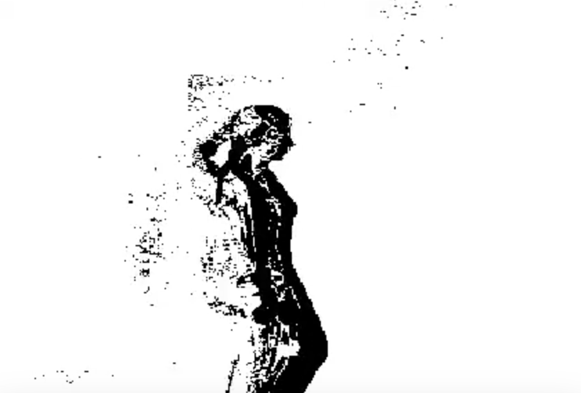  |  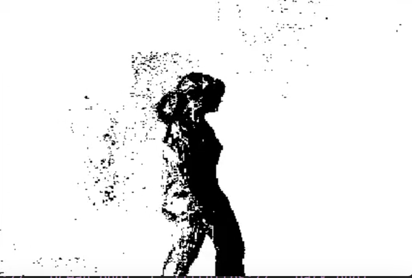 |  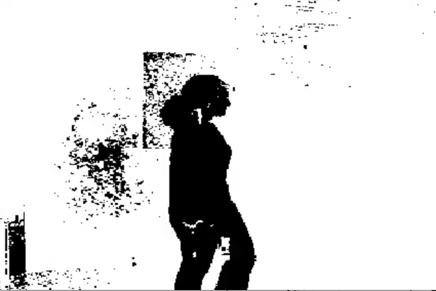 | 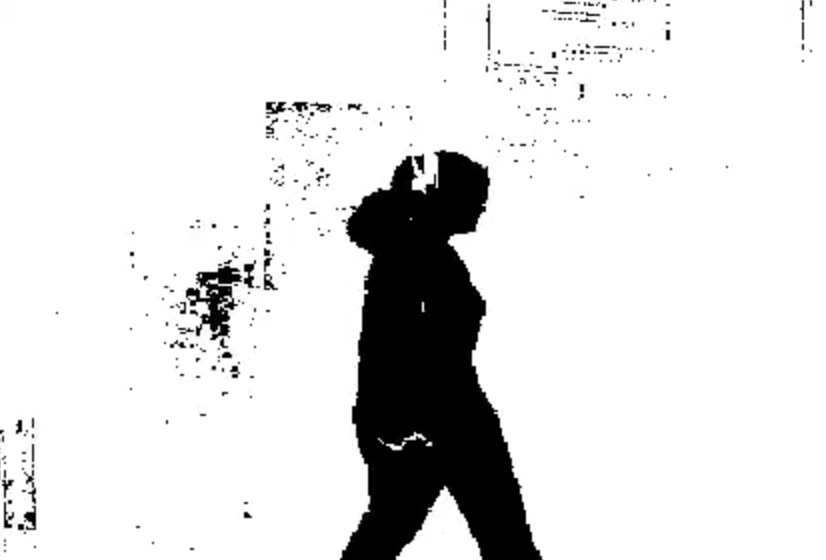

As we can see, choosing the learning rate too high results in the object's contours being ill-defined. 

**Initial variance:**

Whenever we add a new Gaussian, we need to choose an appropriate initial variance. The table shows different segmentation results for different initial variances. As we can see, a small variance results in a smaller chance of classifying pixels as background pixels.

Var = 72    |   Var = 50  |   Var = 32  |  Var = 6
:----------:|:------------:|:-------------:|:-------------:
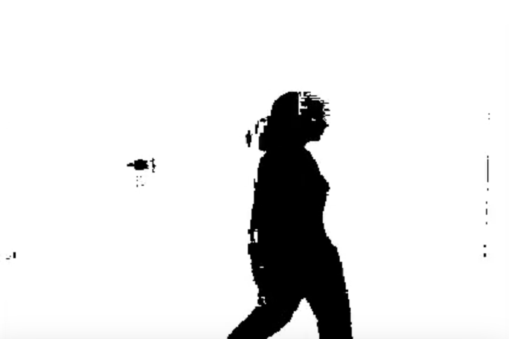  |  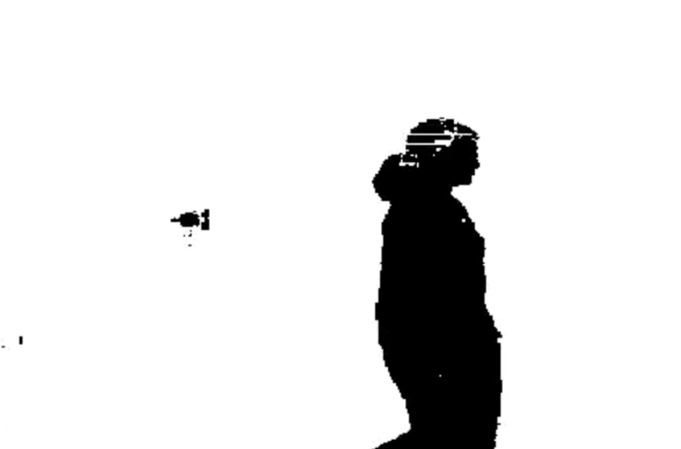 |  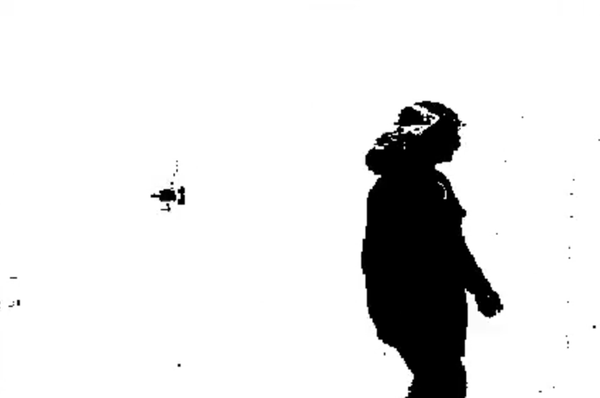 | 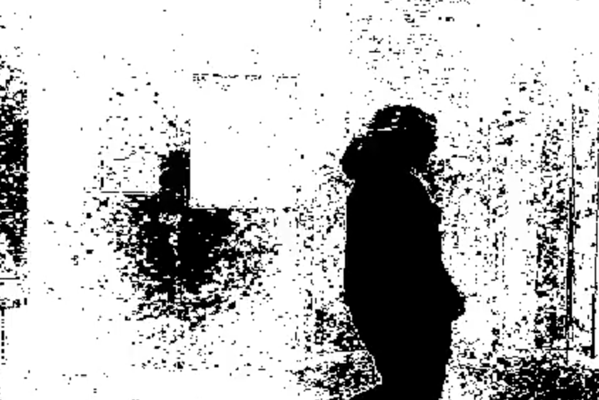

**Initial weight:**

We not only have to set the initial variance for a Gaussian, we also need to define an initial weight. The table shows the segmentation results for different initial weights.

w = 0.5    |   w = 0.25  |   w = 0.1  |  w = 0.03
:----------:|:------------:|:-------------:|:-------------:
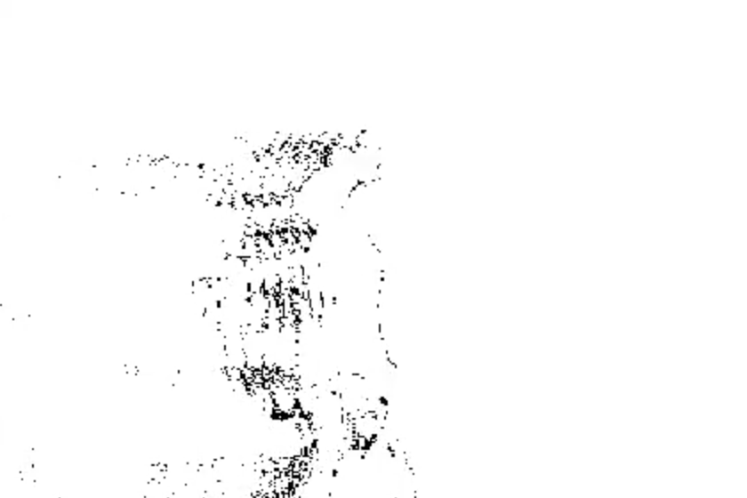  |  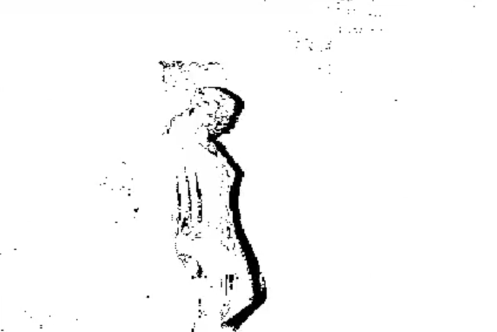 |  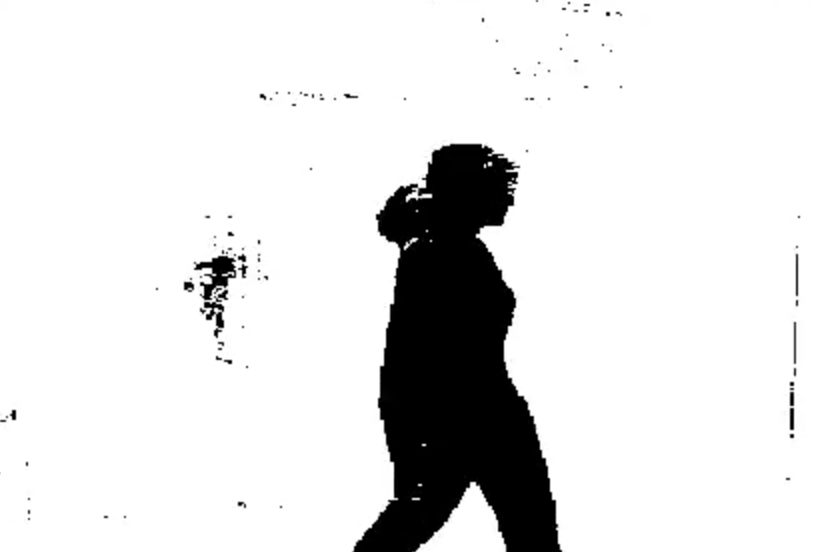 | 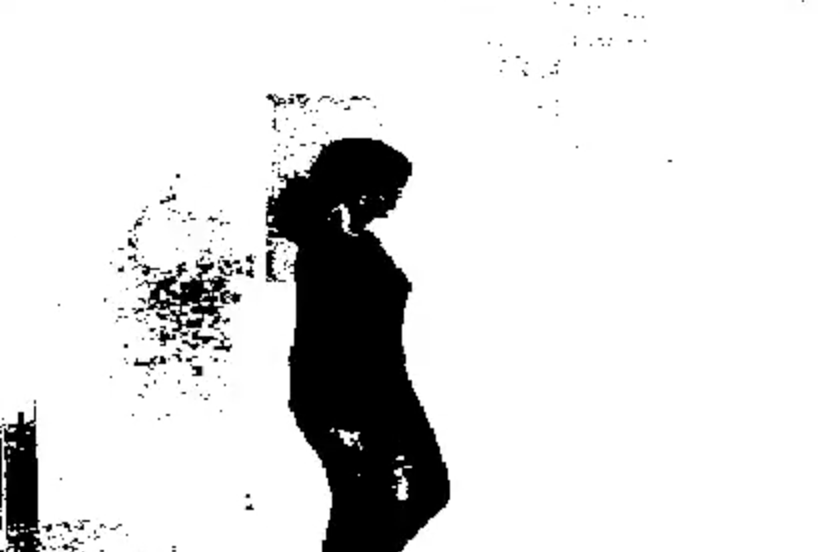


### 8. Result

As stated in section 5 we evaluated the algorithm's performance on eight different scenes by means of the F1-score.

The following table shows the result for each category:

|                           |  I\_BS\_01   |  I\_CA\_01    | I\_IL\_01    |  I\_MB\_01  | I\_MC\_01 | I\_OC\_01 | I\_SI\_01  | I\_SM\_01  |
|---------------------------|--------------|---------------|--------------|-------------|-----------|-----------|------------|------------|
| **F1-Score (our model)**  |    0.964     |   0.97        |  0.862       | 0.982       | 0.690     |   0.99    |   0.989    |  0.72      |
| **F1-Score (benchmark)**  |    0.355     |   0.8811      |  0.2392      | 0.8342      |  -        |   0.95    |   0.8409   |    -       |


According to these numbers our model seems to be far better than the benchmark model. However, it seems to me that we shouldn't trust this comparison. Unfortunately, the website doesn't state how exactly these results were obtained.

For example, our developed model initially tends to treat all pixel values as background pixels. This comes in handy since all scenes first start with multiple background-only frames. As our algorithm predicts background frames first our dataset naturally acts in favor of our dataset.


<center> </center>
<center> </center>

### 8.1. Justification

In this section, we will take a closer look at the results. First, let's take a look at the result for scene I\_SI\_01. According to the description these scene s do not contain camouflage, occlusions, illumination changes, modified background, camera motion or bootstrapping wherefore it should easy to segment. 
Our model also performs extremely well on this scene with an F1-score of 0.989. This confirms our assumption. 

We also achieve similar results for scene I\_CA\_01 (moving objects remaining temporally static on background regions), I\_BS\_01 (moving objects from the first frame) and I\_OC\_01 (totally or partially occluded moving objects).

However, with an F1-score of 0.862 our model seems to have problems with illumination changes. It performs even worse when the camera is not static anymore and starts to move. This behavior can be observed in case of scene I\_MC\_01 and I\_SM\_01.


**Improvement**  
When we look at the resulting segmented videos we can observe that the algorithm has problems to cope with shadows. This suggests the introduction of further post-processing steps like shadow removal. 

### 9. Reflection

The most challenging part of this project was to understand the algorithm in a way that I was able to implement it. Initially, when I read the paper the first time  I thought everything is clear and straightforward to implement. However, soon it turned out that the paper lacks a few important details required to really implement the algorithm. I ended up reading many other papers and other people's code until finally got to a point where I was confident that my solution was right. Again, it showed that it is better to start sketching your algorithm on a piece of paper first than starting to implement immediately.

Furthermore, it was extremely enlightening to see how slow matrix computations can be and my you can speed up our calculations simply by assuming that the data  are iid. Nowadays, you always have in our mind that all devices have enough processing power. But still, writing "smart" and efficient code shouldn't be treated as a second-class citizen.

I also learned that it's almost impossible to get a code like mine written in Python running in real-time. I spent hours looking into different frameworks (like Numa, cPython) and tried to make the computations run in parallel. Python is fantastic for fast prototyping. But if computation-time matters, I would implement it in C / C++ next time.

Finally, I have to say that I'm quite satisfied with my results. Of course, there's still room for improvement, for example, implementing shadow removal. However, I'm really surprised how fast the network can adapt to new scenes. My assumption was that it will take a couple of frames until it produces satisfying results, but all in all it's way faster than I expected. 

### 10. Conclusion

We've analyzed, implemented and evaluated an algorithm for adaptive video foreground-background segmentation.  
The final performance evaluation was done on  eight difference scenes from the LASIESTA dataset. The best F1-scores we obtained were 0.989 and 0.99 on a scene not containing camouflage, illumination changes, modified background, camera motion and not or partially occluded objects. The worst F1-score was 0.690 obtained on a scene with non-completely static cameras. Further improvements could be done by applying shadow removal.

### References

**[1]** Cheung S, Kamath C. Robust background subtraction with
foreground validation for Urban Traffic Video. J Appl Signal Proc,
Special Issue on Advances in Intelligent Vision Systems: Methods
and Applications (EURASIP 2005), New York, USA, 2005; 14:
2330-2340  
**[2]** Carranza J, Theobalt C, Magnor M, Seidel H. Free-Viewpoint
Video of Human Actors, ACM Trans on Graphics 2003; 22(3):
569-577  
**[3]** Olaf Ronneberger, Philipp Fischer, Thomas Brox. U-Net: Convolutional Networks for Biomedical Image Segmentation. CoRR, May 2015  
**[4]** Stauffer C, Grimson W. Adaptive background mixture models for
real-time tracking. Proc IEEE Conf on Comp Vision and Patt Recog
(CVPR 1999) 1999; 246-252.  
**[5]** http://www.gti.ssr.upm.es/data/LASIESTA  
**[6]** https://en.wikipedia.org/wiki/Precision\_and\_recall  
**[7]** https://en.wikipedia.org/wiki/F1_score  
**[8]** A Dempster, N. Laird, and D. Rubin. Maximum likelihood from incomplete data via the EM algorithm. Journal of the Royal Statistical Society, 39 (Series B):1-38, 1977.  
**[9]** https://github.com/dsoellinger/Background-mixture-models-for-real-time-tracking/blob/master/analysis/analysis\_numerical.ipynb  
**[10]** https://numba.pydata.org/  
**[11]** https://brenocon.com/blog/2012/04/f-scores-dice-and-jaccard-set-similarity/